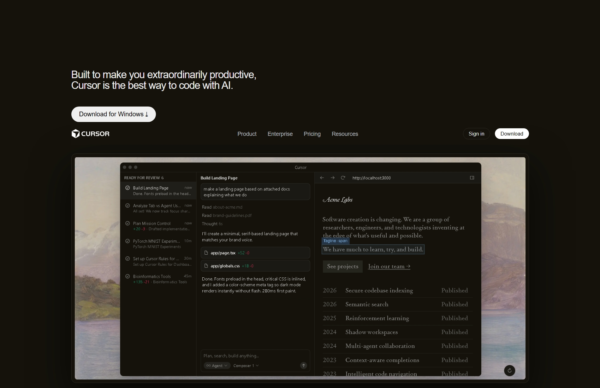
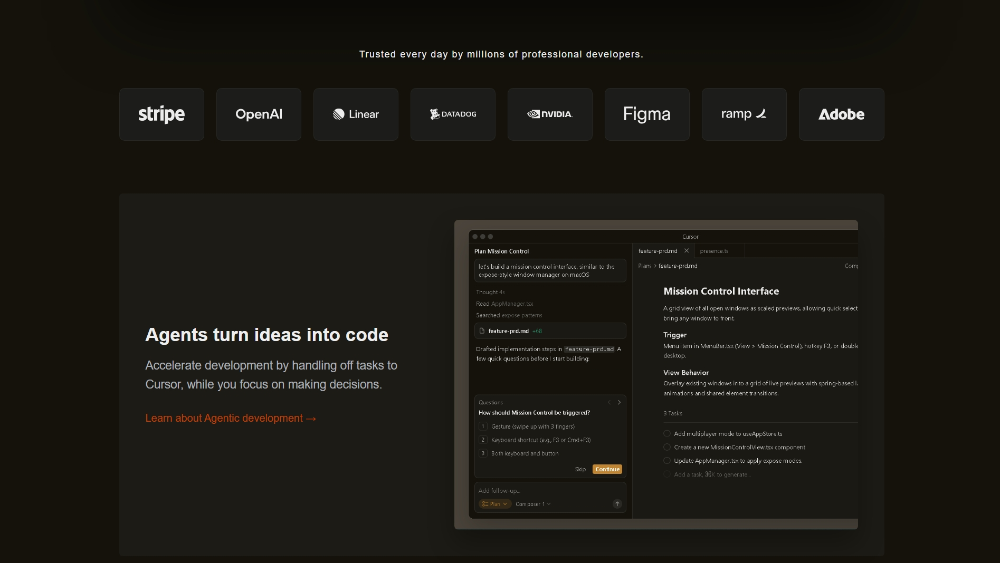
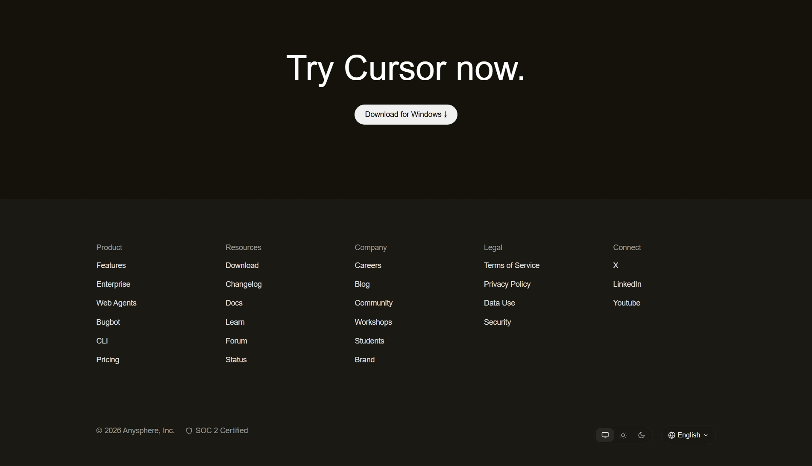

## 📌 Assignment Overview
# Dev Tool Landing Page – Cursor Clone

**Web Dev Cohort 2026 – HTML & CSS Assignment**

This project is a **desktop-first recreation of the Cursor developer tool landing page**, built as part of the Web Dev Cohort 2026 assignment.  
The goal was to closely match the **visual structure, layout, typography, and color palette** of the original Cursor website using **only HTML and CSS**.

🔗 **Live Demo:**  
https://himazing-cursor.netlify.app/

## ⚙️ Constraints Followed

Only **HTML & CSS** used  
No JavaScript  
No Tailwind / CSS frameworks  
No animations or fancy effects  
Desktop-only (no responsiveness required)  
Images and icons inspired by / similar to original site  
Focus on **visual & structural accuracy**

## 📷 Screenshots

### Home Page




### Footer Section


## 🚀 Deployment

The project is hosted using **Netlify** for easy access and evaluation.

🔗 **Live Site:** https://himazing-cursor.netlify.app

## ▶️ How to Run the Project

1. Clone the repository or download the files
2. Open the `index.html` file
3. Run it in any web browser

```bash
open index.html
````

(or double-click the file)

---
## 👤 Author

**Himanshu Kumar**

* LinkedIn: [https://www.linkedin.com/in/himazing](https://www.linkedin.com/in/himazing)
* GitHub: [https://github.com/Himazing](https://github.com/Himazing)
* Portfolio: [https://himanshu-portfolio-tau.vercel.app](https://himanshu-portfolio-tau.vercel.app)


## 📜 License

This project is created for **educational purposes only**.

© 2026 Himanshu Kumar. All rights reserved.

**Built with ❤️ as part of Web Dev Cohort 2026**

**Built with ❤️ as part of Web Dev Cohort 2026**


